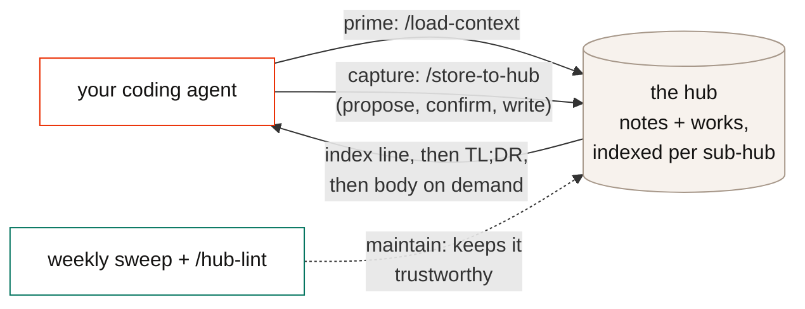
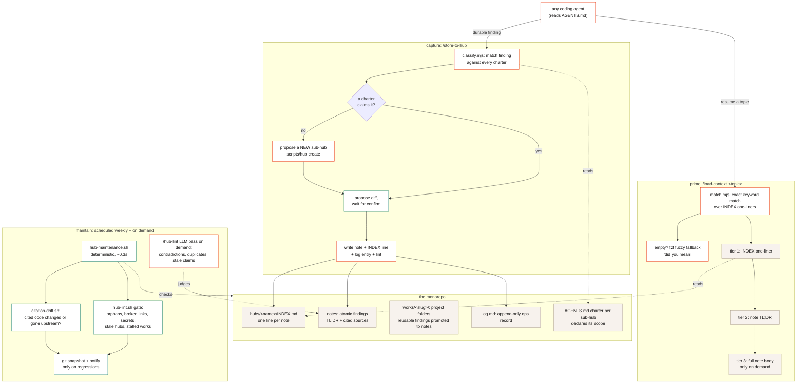

# agent-knowledge-hub

A template for a personal, agent-maintained knowledge monorepo: dense, code-grounded notes that your coding agents read to prime on a topic and write to capture durable findings, so investigations compound instead of evaporating when the session ends.

Three skills drive it: read (`/load-context`), write (`/store-to-hub`), maintain (`/hub-lint`). **Agent-agnostic by design**: the contract is `AGENTS.md` (the open standard read natively by Claude Code, Codex, Cursor, Copilot, Gemini CLI, Aider, and most coding agents), and every operation underneath is a plain CLI any agent can run. The slash-command packaging installs into Claude Code and Codex out of the box; the [skills CLI](https://github.com/vercel-labs/skills) distributes it to the rest.

Read the **[field guide](https://eyupcanbodur.github.io/agent-knowledge-hub/hub-guide.html)** for the full why/how/workflow (also at `docs/hub-guide.html` locally).

## How it works

At a glance:



In detail:



The loop in one sentence: **prime** pulls the smallest useful slice of past knowledge (index line, then TL;DR, then body), **capture** routes a new finding to whichever sub-hub charter claims it (or grows a new one) behind a propose-confirm gate, and **maintain** runs deterministic hygiene on a schedule so the knowledge stays trustworthy without anyone remembering to check.

## Get started

Use this template (or clone, any path works; `install.sh` records the location as `HUB_ROOT`), then:

```bash
cd ~/workspace/agent-knowledge-hub && ./install.sh
```

`install.sh` symlinks the skills into `~/.claude/skills/` and `~/.codex/skills/` (restart the harness after), makes the hooks runnable, and records `HUB_ROOT`. Optional: `brew install fzf` enables fuzzy retrieval (fzf subsequence matching, presented as "did you mean"; it catches doubled or dropped letters, not arbitrary edits).

The `hubs/example/` sub-hub ships with two sample notes; read them for the format, then clear it and create your own:

```bash
./scripts/hub create <your-hub>
```

Then edit `hubs/<your-hub>/AGENTS.md`: one line of scope (what findings this hub claims) is enough to start.

Skills-only install (no clone): `npx skills add <your-fork> --all` distributes them to every supported harness via the [skills CLI](https://github.com/vercel-labs/skills).

## Layout

```text
agent-knowledge-hub/
├── AGENTS.md            the umbrella charter: hub isolation, routing, session loop
│                        (CLAUDE.md just redirects here; most agents read AGENTS.md natively)
├── CONTEXT.md           the glossary: one canonical word per concept (note, work, routing, ...)
├── INDEX.md             catalog of sub-hubs (each sub-hub has its own INDEX for notes)
├── install.sh           setup: symlinks skills into ~/.claude + ~/.codex, records HUB_ROOT
│
├── hubs/                YOUR KNOWLEDGE LIVES HERE, one sub-hub per domain
│   └── example/         ships with the template; read for style, then replace
│       ├── AGENTS.md    this hub's charter: scope declaration + note voice
│       ├── INDEX.md     one line per note, the retrieval surface load-context matches
│       ├── log.md       append-only record of every write
│       ├── *.md         the notes (atomic findings, TL;DR first)
│       └── works/       multi-step project folders (numbered files + status)
│
├── skills/              the three workflows, symlinked into your agents by install.sh
│   ├── load-context/    read: INDEX match -> fzf fuzzy -> TL;DR -> body (bin/ tests/ evals/)
│   ├── store-to-hub/    write: classify vs charters, dedup, propose-confirm (bin/ tests/ evals/)
│   └── hub-lint/        maintain: deterministic gate + LLM pass for contradictions
│
├── scripts/
│   ├── hub              CLI: create <name> (scaffold a sub-hub), list
│   ├── hub-maintenance.sh   the weekly sweep: lint all hubs, git snapshot, notify on regressions
│   └── citation-drift.sh    do notes cite code that changed or vanished upstream?
│
├── scripts/checks/       small deterministic checks the skills and sweep call
│   ├── validate-note.sh     write gate: secrets and format (hard fail)
│   ├── check-index-updated.sh  every note has an INDEX entry
│   ├── append-log.sh        one consistent log line per write
│   ├── hub-lint.sh          the full gate: orphans, links, staleness (exit 1 on BLOCK)
│   └── test-hooks.sh        tests for all of the above
│
├── template/            starter files `scripts/hub create` copies for a new sub-hub
└── docs/
    ├── note-format.md   the canonical note shape (what store-to-hub writes, lint checks)
    ├── hub-guide.html   the field guide (also live on GitHub Pages)
    └── adr/             design rationale with sources; read 0001 first
```

Rule of thumb: `hubs/` is yours, everything else is machinery you rarely touch.

## The model in five lines

1. A **note** is atomic, cross-project, and findable: one INDEX line + a `## TL;DR` + a code-cited body (`docs/note-format.md`).
2. A **work** is a goal-bound project folder; reusable findings get **promoted** to notes.
3. **Routing is charter-driven**: each sub-hub's `AGENTS.md` declares its scope; no fit means create a new sub-hub.
4. Retrieval is a ladder: INDEX one-liners, then TL;DRs, then full bodies, never a bulk dump. Exact match first, `fzf` fuzzy fallback, agent judgment last.
5. **Maintenance is scheduled, not remembered**: `scripts/hub-maintenance.sh` (weekly via launchd/cron) lints every hub, snapshots to git, checks citation drift, and notifies only on regressions.

## Make your agents aware of it

Inside the repo, every AGENTS.md-reading agent picks the contract up automatically. For the hub to be available **all the time, from any working directory**, add a short pointer to each agent's global instructions (Claude Code's `~/.claude/CLAUDE.md`, Codex's `~/.codex/AGENTS.md`, Cursor's user rules, etc.):

```text
## Knowledge hub
~/workspace/agent-knowledge-hub is my curated knowledge monorepo (sub-hubs under hubs/).
- Prime: before starting topic work, search it:
  node "$HUB_ROOT"/skills/load-context/bin/match.mjs "<topic>" --json
- Capture: after a substantive investigation (30+ min, reusable, non-obvious), propose a note
  following its docs/note-format.md; show the full note and wait for my confirmation before
  writing; then update the sub-hub INDEX.md and log via scripts/checks/append-log.sh.
- Never store sensitive data or credentials: cite the pointer, never the payload.
```

That snippet plus the CLIs is the whole integration; no server, no protocol. (If you ever need the hub from an agent **without shell access**, or want machine-enforced write gating, see ADR 0005 for the deferred MCP design.)

## Maintenance

Wire `scripts/hub-maintenance.sh` into launchd/cron weekly. It runs the deterministic gate over every sub-hub, auto-commits a git snapshot, and reports citation drift (notes citing code that changed or vanished upstream in your local clones). The LLM pass (`/hub-lint`) stays on demand.

## Design rationale

`docs/adr/` records why the system is shaped this way (no frontmatter, INDEX as the retrieval surface, log + git, charter-driven routing, the maintenance loop), with sources (Karpathy's LLM-wiki, Anthropic's context-engineering guidance, PARA/evergreen notes, Letta's context repositories). Read `0001` first.
