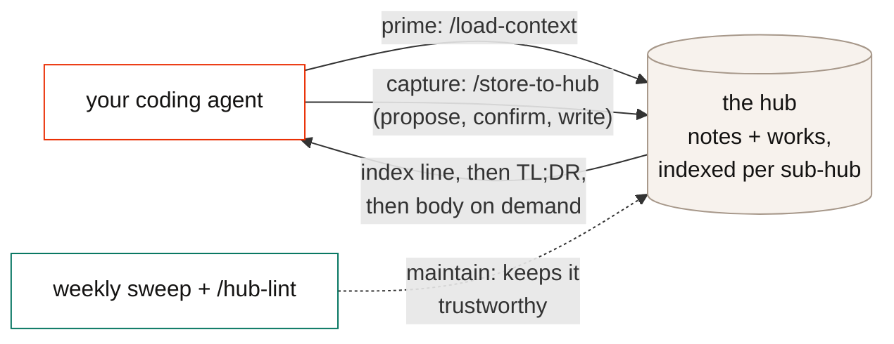
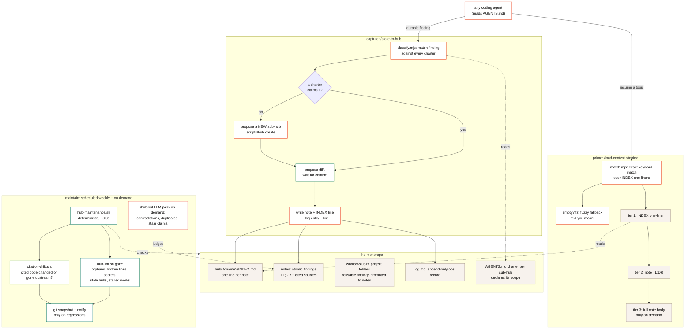

# agent-knowledge-hub

**Your coding agent forgets everything. Every investigation evaporates at session end, and next week it re-derives it all. This template fixes that.**

[](https://github.com/eyupcanbodur/agent-knowledge-hub/actions/workflows/ci.yml)
[](LICENSE)
[](https://eyupcanbodur.github.io/agent-knowledge-hub/hub-guide.html)
[](https://github.com/eyupcanbodur/agent-knowledge-hub/generate)

A personal knowledge monorepo your coding agents **read** before working, **write** after investigating, and **maintain** on a schedule, so findings compound instead of evaporating. Plain markdown, small deterministic scripts, no server, no database, no embeddings.

**Agent-agnostic by design:** the contract is `AGENTS.md` (read natively by Claude Code, Codex, Cursor, Copilot, Gemini CLI, Aider, and most coding agents), and every operation is a plain CLI any agent can run. Slash-command packaging ships for Claude Code and Codex; the [skills CLI](https://github.com/vercel-labs/skills) distributes it to the rest.



## The three skills

The entire workflow is three commands. Each is a thin prompt over a deterministic, tested CLI, so the behavior is inspectable and identical on every platform.

| Skill | What it does | The guarantee |
|---|---|---|
| **`/load-context <topic>`** | Primes the agent: matches the topic against every sub-hub's INDEX, returns the top notes with their TL;DRs, dives into full bodies only on demand. Falls back to `fzf` fuzzy matching ("did you mean") when exact matching finds nothing; with no topic, shows the whole catalog. | Retrieval costs one INDEX read, never a context dump. Selection quality is regression-tested by an eval. |
| **`/store-to-hub`** | Captures a finding: classifies it against every sub-hub's charter, dedupes against existing notes, then **shows the full note or diff and waits for confirmation** before writing. Confirmed writes are followed by INDEX update, log entry, and a lint pass, automatically. No charter fits? It proposes creating a new sub-hub instead of forcing a bad fit. | Nothing is written without a previewed, validated payload. The write gate hard-rejects secret-shaped strings. |
| **`/hub-lint [hub]`** | Maintains: runs the deterministic gate (orphans, broken links, missing INDEX or log entries, secrets, stale hubs, stalled works), then an LLM pass for what scripts cannot see: contradictions between notes, duplicate topics, stale claims. | Proposes fixes, never applies them. The deterministic half also runs weekly without you. |

Underneath, harness-agnostic CLIs any agent (or you) can call directly:

```bash
node skills/load-context/bin/match.mjs "<topic>" --json     # retrieve
node skills/store-to-hub/bin/classify.mjs "<topic>" --json  # classify + dedup
scripts/checks/hub-lint.sh hubs/<name>                      # health gate
scripts/checks/append-log.sh <hub> <op> <note> "<why>"      # log a write
```

## Quickstart

```bash
# 1. Use this template on GitHub (or clone; any path works)
git clone https://github.com/eyupcanbodur/agent-knowledge-hub.git ~/workspace/agent-knowledge-hub

# 2. Install: links the skills into Claude Code + Codex, records HUB_ROOT
cd ~/workspace/agent-knowledge-hub && ./install.sh

# 3. Restart your agent, read hubs/example/ for the note style, then start your own
./scripts/hub create <your-domain>
```

About two minutes. Optional: `brew install fzf` enables fuzzy retrieval (subsequence matching, surfaced as "did you mean"; it catches doubled or dropped letters, not arbitrary edits).

## Receipts, not claims

From the original instance this system was built in:

- **A real contradiction, caught.** Two notes disagreed about the same fix (one recommended a command, the other proved it harmful). The lint pass surfaced it; the notes were merged into one canonical answer.
- **3 dead citations, found automatically.** The weekly citation-drift check compared notes against upstream code and flagged three notes citing files that had moved or been deleted. Confidently-stale knowledge is the worst kind; now it surfaces on a schedule.
- **Retrieval is tested.** A regression-gated eval runs the matcher against the real hubs (exact and fuzzy cases, 100%). It once caught an INDEX entry polluting selection.
- **Adopted by a stranger, from docs alone.** A zero-context agent was pointed at this README and completed the full loop (install, new hub, note, retrieve, lint) unaided. Its five friction findings were fixed at the generator, and that gate is now in [CONTRIBUTING](CONTRIBUTING.md).

## How it works, in detail

<details>
<summary>Full flow: prime / capture / maintain around the hub (diagram)</summary>



</details>

The loop in one sentence: **prime** pulls the smallest useful slice of past knowledge (index line, then TL;DR, then body), **capture** routes a new finding to whichever sub-hub charter claims it (or grows a new one) behind a propose-confirm gate, and **maintain** runs deterministic hygiene on a schedule so the knowledge stays trustworthy without anyone remembering to check.

The model in five lines:

1. A **note** is atomic, cross-project, and findable: one INDEX line + a `## TL;DR` + a code-cited body ([docs/note-format.md](docs/note-format.md)).
2. A **work** is a goal-bound project folder; reusable findings get **promoted** to notes.
3. **Routing is charter-driven**: each sub-hub's `AGENTS.md` declares its scope; no fit means create a new sub-hub.
4. Retrieval is a ladder: INDEX one-liners, then TL;DRs, then full bodies, never a bulk dump.
5. **Maintenance is scheduled, not remembered.**

## Layout

```text
agent-knowledge-hub/
├── AGENTS.md            the umbrella charter: hub isolation, routing, session loop
│                        (CLAUDE.md just redirects here; most agents read AGENTS.md natively)
├── CONTEXT.md           the glossary: one canonical word per concept (note, work, routing, ...)
├── INDEX.md             catalog of sub-hubs (each sub-hub has its own INDEX for notes)
├── install.sh           setup: symlinks skills into ~/.claude + ~/.codex, records HUB_ROOT
│
├── hubs/                YOUR KNOWLEDGE LIVES HERE, one sub-hub per domain
│   └── example/         ships with the template; read for style, then replace
│       ├── AGENTS.md    this hub's charter: scope declaration + note voice
│       ├── INDEX.md     one line per note, the retrieval surface load-context matches
│       ├── log.md       append-only record of every write
│       ├── *.md         the notes (atomic findings, TL;DR first)
│       └── works/       multi-step project folders (numbered files + status)
│
├── skills/              the three workflows, symlinked into your agents by install.sh
│   ├── load-context/    read: INDEX match -> fzf fuzzy -> TL;DR -> body (bin/ tests/ evals/)
│   ├── store-to-hub/    write: classify vs charters, dedup, propose-confirm (bin/ tests/ evals/)
│   └── hub-lint/        maintain: deterministic gate + LLM pass for contradictions
│
├── scripts/
│   ├── hub              CLI: create <name> (scaffold a sub-hub), list
│   ├── hub-maintenance.sh   the weekly sweep: lint all hubs, git snapshot, notify on regressions
│   ├── citation-drift.sh    do notes cite code that changed or vanished upstream?
│   └── checks/          deterministic gates any agent can run
│       ├── validate-note.sh        write gate: secrets and format (hard fail)
│       ├── check-index-updated.sh  every note has an INDEX entry
│       ├── append-log.sh           one consistent log line per write
│       ├── hub-lint.sh             the full gate (exit 1 on BLOCK)
│       └── test-hooks.sh           tests for all of the above
│
├── template/            starter files `scripts/hub create` copies for a new sub-hub
└── docs/
    ├── note-format.md   the canonical note shape (what store-to-hub writes, lint checks)
    ├── hub-guide.html   the field guide (live on GitHub Pages)
    └── adr/             design rationale with sources; read 0001 first
```

Rule of thumb: `hubs/` is yours, everything else is machinery you rarely touch.

## Make your agents aware of it

Inside the repo, every AGENTS.md-reading agent picks the contract up automatically. For the hub to be available **all the time, from any working directory**, add a short pointer to each agent's global instructions (Claude Code's `~/.claude/CLAUDE.md`, Codex's `~/.codex/AGENTS.md`, Cursor's user rules, etc.):

```text
## Knowledge hub
~/workspace/agent-knowledge-hub is my curated knowledge monorepo (sub-hubs under hubs/).
- Prime: before starting topic work, search it:
  node "$HUB_ROOT"/skills/load-context/bin/match.mjs "<topic>" --json
- Capture: after a substantive investigation (30+ min, reusable, non-obvious), propose a note
  following its docs/note-format.md; show the full note and wait for my confirmation before
  writing; then update the sub-hub INDEX.md and log via scripts/checks/append-log.sh.
- Never store sensitive data or credentials: cite the pointer, never the payload.
```

That snippet plus the CLIs is the whole integration; no server, no protocol. (For agents **without shell access**, or machine-enforced write gating, see [ADR 0005](docs/adr/0005-skills-not-mcp.md) for the deferred MCP design.)

## Why not just...

- **...RAG / embeddings?** Retrieval quality is not the bottleneck; knowledge rot is. A vector index over stale notes returns confidently wrong answers faster. Here the index is human-curated one-liners (cheap, inspectable) and the maintenance loop attacks staleness directly.
- **...a memory plugin?** Passive session memory is a great safety net and pairs well with this (see [ADR 0002](docs/adr/0002-claude-mem-boundary-and-session-lifecycle.md)). But machine-summarized episodic memory is unverified and keeps the dead ends. The hub is the curated layer: human-confirmed, code-cited, shareable.
- **...a notes app?** Notes apps optimize for humans writing. This optimizes for agents reading (progressive disclosure, deterministic retrieval, charter routing) and agents writing safely (propose-confirm, validation gates, logging). It is plain markdown, so it stays perfectly readable by you.

## Maintenance

Wire `scripts/hub-maintenance.sh` into launchd/cron weekly: it lints every sub-hub, snapshots changes to git, checks citation drift against your local clones, and notifies only on regressions. The LLM pass (`/hub-lint`) stays on demand. See [ADR 0004](docs/adr/0004-maintenance-loop.md).

## Design rationale

[`docs/adr/`](docs/adr/) records why the system is shaped this way (no frontmatter, INDEX as the retrieval surface, log + git, charter-driven routing, the maintenance loop, skills over MCP), with sources: Karpathy's LLM-wiki, Anthropic's context-engineering guidance, PARA, evergreen notes, Letta's context repositories. Read [0001](docs/adr/0001-hub-knowledge-management.md) first.

## Contributing

One hard rule: the **fresh-agent gate**. Anything that affects how a new user adopts this must survive a zero-context agent following the docs alone. See [CONTRIBUTING.md](CONTRIBUTING.md).

## License

[MIT](LICENSE)
