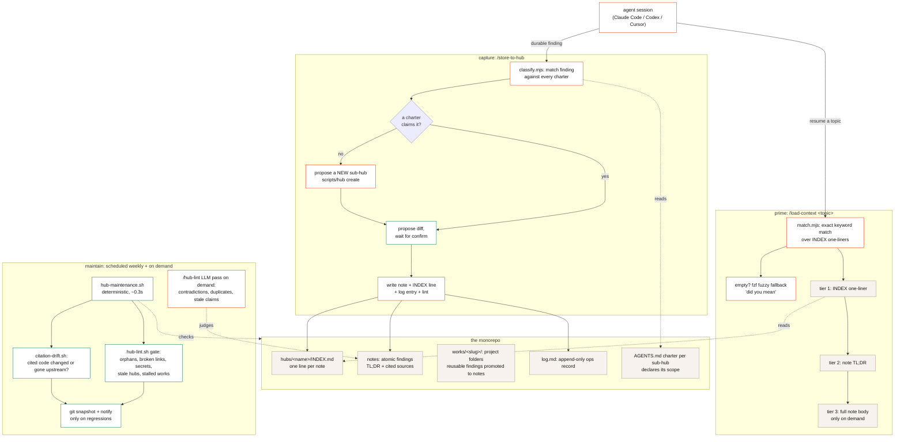

# agent-knowledge-hub

A template for a personal, agent-maintained knowledge monorepo: dense, code-grounded notes that your coding agents read to prime on a topic and write to capture durable findings, so investigations compound instead of evaporating when the session ends.

Three skills drive it: read (`/load-context`), write (`/store-to-hub`), maintain (`/hub-lint`). Works with **Claude Code, Codex, and Cursor** (`AGENTS.md` is the shared contract; the skills install into Claude Code and Codex, and every operation underneath is a plain CLI any agent can run).

Open `docs/hub-guide.html` for the full why/how/workflow.

## How it works



The loop in one sentence: **prime** pulls the smallest useful slice of past knowledge (index line, then TL;DR, then body), **capture** routes a new finding to whichever sub-hub charter claims it (or grows a new one) behind a propose-confirm gate, and **maintain** runs deterministic hygiene on a schedule so the knowledge stays trustworthy without anyone remembering to check.

## Get started

Use this template (or clone), then:

```bash
cd ~/workspace/agent-knowledge-hub && ./install.sh
```

`install.sh` symlinks the skills into `~/.claude/skills/` and `~/.codex/skills/` (restart the harness after), makes the hooks runnable, and records `HUB_ROOT`. Optional: `brew install fzf` enables typo-tolerant retrieval.

The `hubs/example/` sub-hub ships with two sample notes; read them for the format, then clear it and create your own:

```bash
./scripts/hub create <your-hub>
```

Then edit `hubs/<your-hub>/AGENTS.md`: one line of scope (what findings this hub claims) is enough to start.

Skills-only install (no clone): `npx skills add <your-fork> --all` distributes them to every supported harness via the [skills CLI](https://github.com/vercel-labs/skills).

## Layout

```
hubs/<name>/     a full hub: AGENTS.md + INDEX.md + log.md + notes (+ works/)
template/        starter scaffold for a new hub
scripts/hub      CLI: create, list
scripts/         hub-maintenance.sh (weekly sweep), citation-drift.sh
skills/          load-context, store-to-hub, hub-lint (symlinked by install.sh)
install.sh       setup
.claude/hooks/   deterministic checks: validate-note, check-index, append-log, hub-lint
docs/            note-format.md, hub-guide.html, adr/ (design rationale)
```

## The model in five lines

1. A **note** is atomic, cross-project, and findable: one INDEX line + a `## TL;DR` + a code-cited body (`docs/note-format.md`).
2. A **work** is a goal-bound project folder; reusable findings get **promoted** to notes.
3. **Routing is charter-driven**: each sub-hub's `AGENTS.md` declares its scope; no fit means create a new sub-hub.
4. Retrieval is a ladder: INDEX one-liners, then TL;DRs, then full bodies, never a bulk dump. Exact match first, `fzf` fuzzy fallback, agent judgment last.
5. **Maintenance is scheduled, not remembered**: `scripts/hub-maintenance.sh` (weekly via launchd/cron) lints every hub, snapshots to git, checks citation drift, and notifies only on regressions.

## Maintenance

Wire `scripts/hub-maintenance.sh` into launchd/cron weekly. It runs the deterministic gate over every sub-hub, auto-commits a git snapshot, and reports citation drift (notes citing code that changed or vanished upstream in your local clones). The LLM pass (`/hub-lint`) stays on demand.

## Design rationale

`docs/adr/` records why the system is shaped this way (no frontmatter, INDEX as the retrieval surface, log + git, charter-driven routing, the maintenance loop), with sources (Karpathy's LLM-wiki, Anthropic's context-engineering guidance, PARA/evergreen notes, Letta's context repositories). Read `0001` first.
